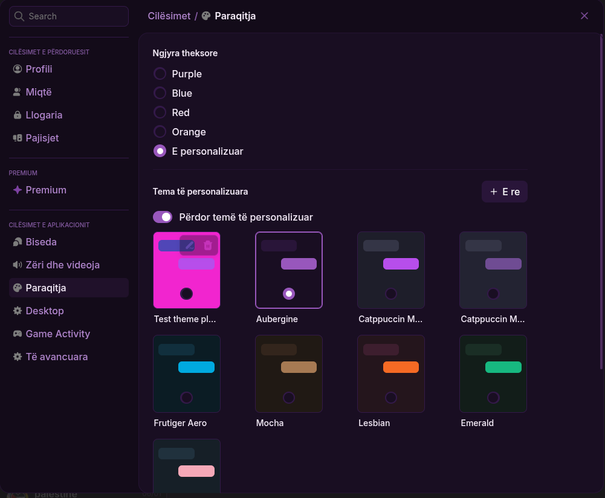
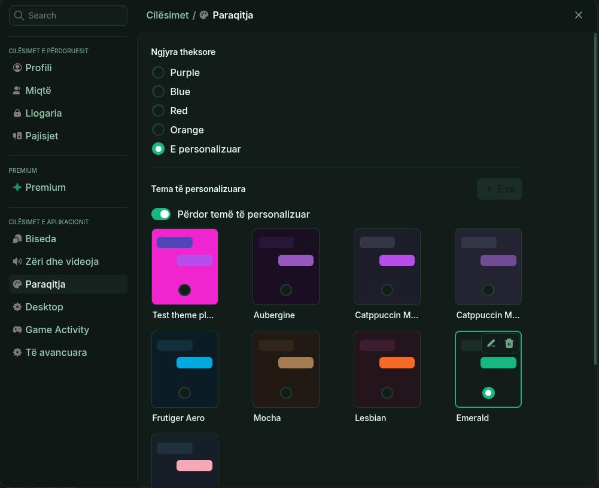
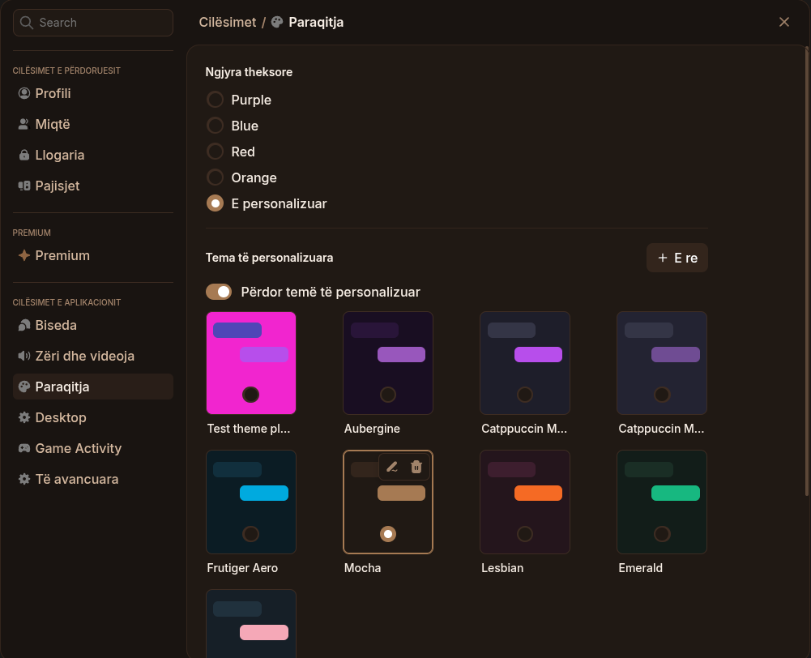
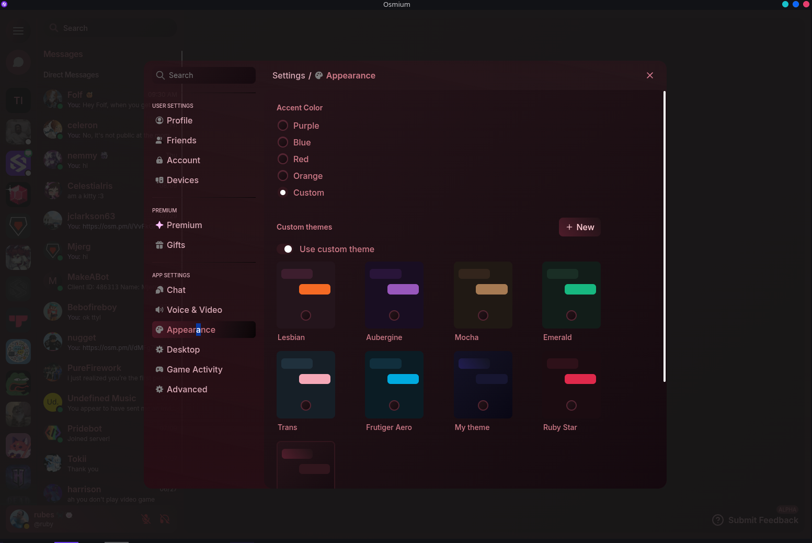
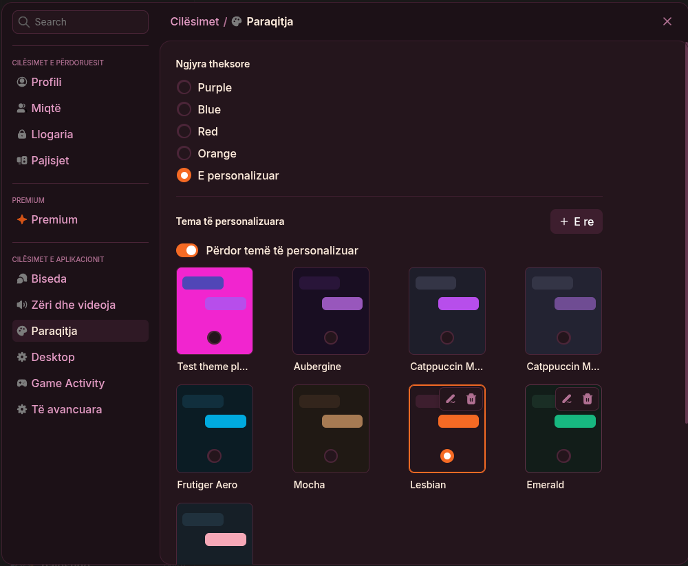
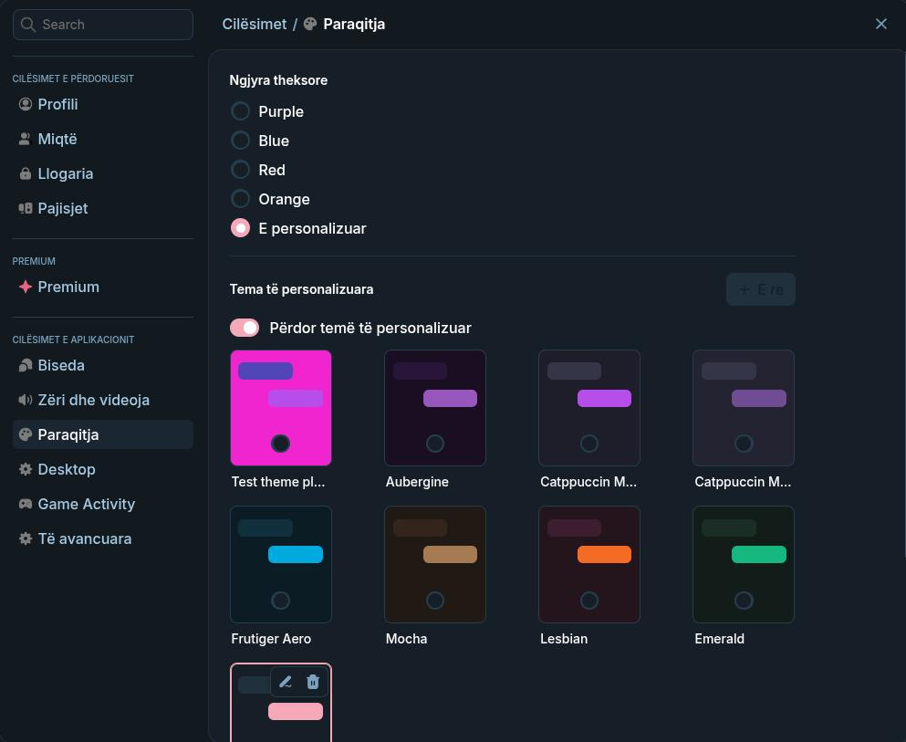
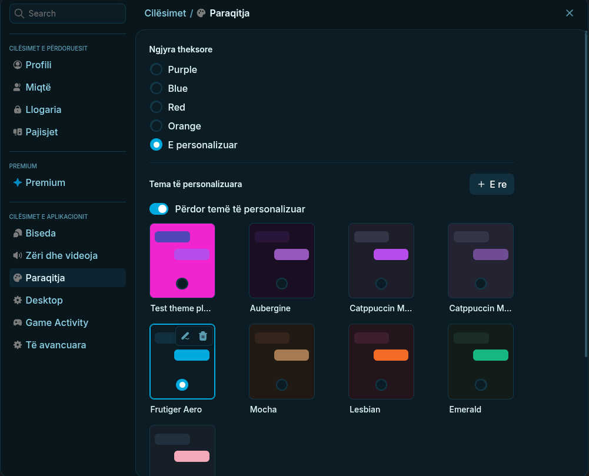

# Osmium Themes

A collection of custom themes for **Osmium**, eight palettes with native `.osmtheme` files.

---

## Themes

### Dark

|  |  |  |  |
|:-:|:-:|:-:|:-:|
| **Aubergine** | **Emerald** | **Mocha** | **Ruby Star** |
| Deep purple, the house style | Teal-forward, sibling to Aubergine | Warm, low-contrast dark | Gemstone red over wine-black gradients |

Aubergine and Emerald share the same structure and contrast ratios, only the accent hue changes (`#6b21a8` vs `#0F5C58`).

Ruby Star is gradient-based rather than flat. The tinting lives in the `--neutral-700/800/900` ramp, so surfaces fade continuously instead of tiling per element. It ships with `forceAccent: true` — set your custom accent to `#e0244a` to drive the primary color.

### Pride

|  |  |
|:-:|:-:|
| **Lesbian Pride** | **Trans Pride** |
| Flag gradient accents on dark | Flag gradient accents on dark |

### Novelty

|  |
|:-:|
| **Frutiger Aero** |
| Glossy, glass, aggressively 2007 |

---

## Installation

### `.osmtheme` - recommended

1. Download the theme you want from the [latest release](../../releases/latest), or grab the file directly from its folder in `themes/`
2. Open Osmium and go to **Settings → Appearance → Themes**
3. Import the `.osmtheme` file
4. Select it from the theme list

---

## Making your own

The quickest route is usually to start from an existing theme. Duplicate `themes/aubergine.osmtheme`, swap the accent colors, and adjust from there.

For a gradient theme, start from `themes/ruby-star.osmtheme` instead — gradients belong on the foundation ramp and the large surface tokens, not on `--bg-soft-200` or `--bg-surface-800`, which repeat across every bubble and hover state.

Two things worth knowing before you edit:

- Osmium only accepts its own token names. Inventing a new ramp (`--ruby-500`, `--gold-500`) reports every one of them as a broken value, even though the JSON is valid.
- In dark mode the `--bg-*` scale is inverted: `--bg-white-0` is the darkest step and it climbs to `--bg-strong-950` being nearly white. Setting `--bg-intense-700` or `--bg-surface-800` to a saturated accent flattens the hierarchy.

---

## Contributing

To add a theme:

- Include the `.osmtheme` file, and a `filename.png`.
- Screenshots: same view, same window size, same content as the existing previews so the comparison table stays the same.
- Add your row to the table above.

---

⭐ **Star the Repo!**

Made by [aubergine-ux](https://github.com/aubergine-ux)

